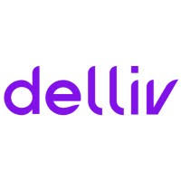

<p align="center">
  
</p>


## **💻** Projeto

Projeto para conclusão do desafio técnico proposto pela Delliv, que consiste em criar um sistema de compras online. Mais detalhes [aqui](https://github.com/delliv-tech/delliv-coding-challenge-fullstack-junior/commits?author=danielpatricio-delliv). Foi criada a paleta de cores personalizada com base na logo da delliv.

## Tecnologias utilizadas

- [NestJS](https://nestjs.com/)
- [PrismaORM](https://www.prisma.io/)


## Cadastro de informações

```bash
## GET /products
## PUT /products/:id
## DELETE /products/:id
## POST /products
```

Para cadastro, o formato solicitado deverá ser: 

```
{
	name: string,
	description: string,
	price: string,
	category: string,
	imgSrc: string
}
```


## **🚀** Como Executar

Antes de baixar o projeto você vai precisar ter instalado na sua máquina as seguintes ferramentas:

- [Git](https://git-scm.com/)
- [NodeJS](https://nodejs.org/en/)
- [NPM](https://www.npmjs.com/)

Segue os comandos para baixar e executar o projeto na sua máquina:

```bash
## Clone o projeto api em sua máquina
git clone https://github.com/srsouzaj/delliv-api

# Instalar suas dependências
$ npm install

#instalar o banco de dados
$ docker-compose up -d

##popular tabela no banco de dados
# executar o servidor em modo de desenvolvimento
$ npm run start:dev


# para visualizar os dados
npx prisma studio
```


